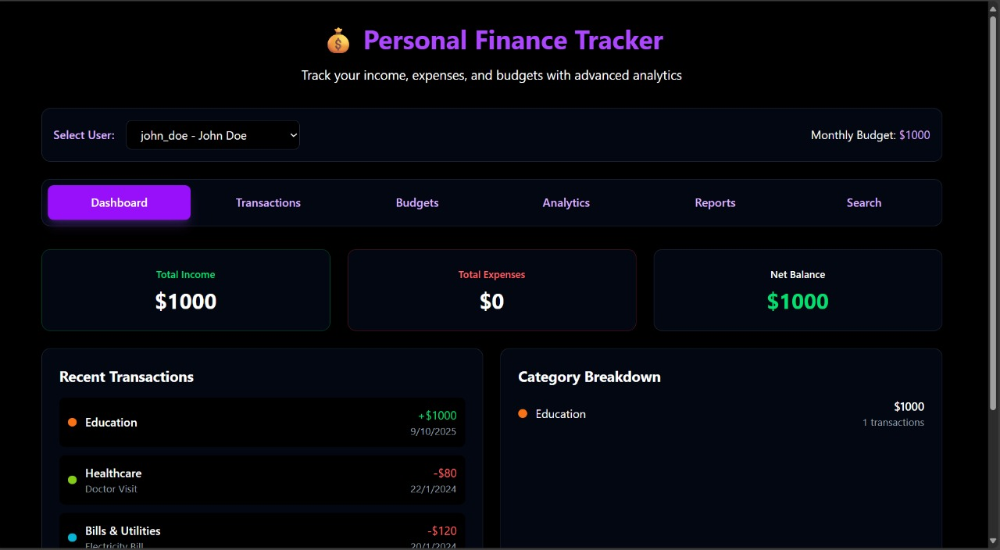
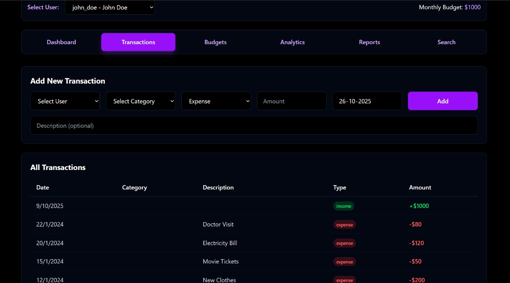
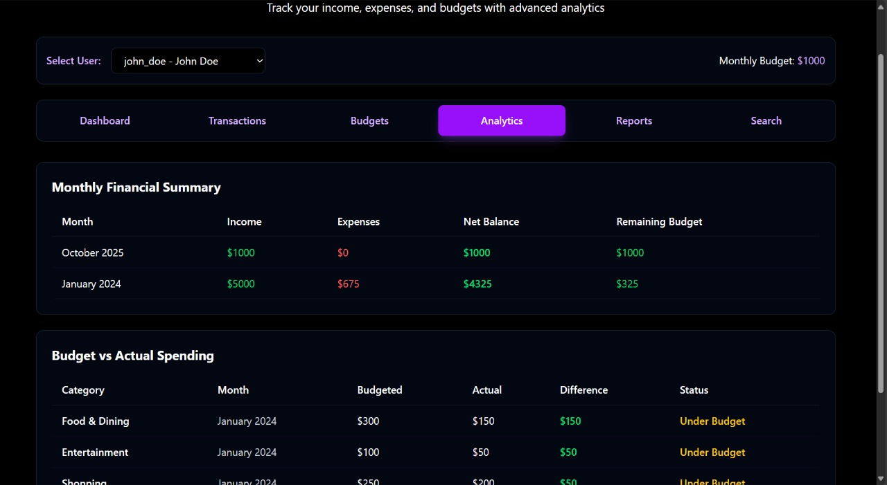
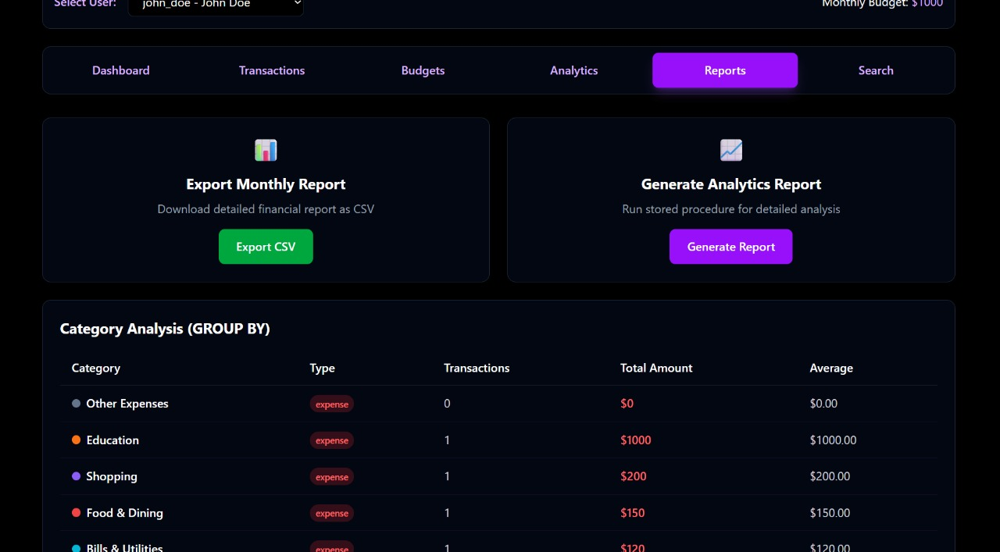
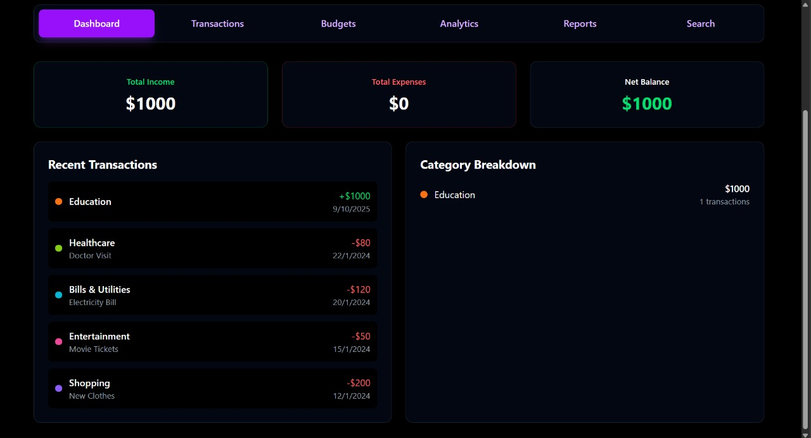

# 💰 Personal Finance Tracker — README

A compact, developer-friendly README for the Personal Finance Tracker project.  
This repo demonstrates a PostgreSQL schema for tracking users, categories, transactions, budgets, and analytics, and exposes them via a FastAPI backend. It highlights advanced SQL features (views, window functions, materialized views, triggers, stored procedures) and includes endpoints for exporting reports and generating analytics. ✨

---
[](#)  

### 🌐 Live demo: (add your frontend/deployment URL here)
---
## 📚 Table of contents
- Project overview
- Schema summary
- Key SQL queries, significance, and example outputs
- FastAPI endpoints (overview)
- Usage & setup
- Troubleshooting & notes

---

## 🧭 Project overview

Features
- 👥 User CRUD (create, read)
- 🗂️ Category management (expense / income)
- 💸 Transaction recording (income & expense), with search & filters
- 🧾 Budgets by category/month and budget vs actual comparisons
- 📊 Analytical SQL views and a materialized view for fast dashboard reads
- 🔁 Trigger to keep user balance or derived metrics up-to-date
- 📁 CSV export for monthly reports
- 🛠️ Endpoint to call stored procedures (generate reports) and refresh analytics

Advanced SQL features used
- Views, Materialized Views, Triggers, Stored Procedures
- Window functions: RANK(), PERCENT_RANK()
- GROUP BY with HAVING, UNION ALL
- LIKE / ILIKE for pattern matching
- Date functions (DATE_TRUNC, EXTRACT) and complex aggregations

---

## 🗂️ Schema summary (short)

- users (id, username, email, full_name, monthly_budget, created_at, updated_at)
- categories (id, name, type {income|expense}, color, user_id, created_at)
- transactions (id, user_id, category_id, amount, description, transaction_date, type, created_at)
- budgets (id, user_id, category_id, amount, month_year, created_at)
- Views:
  - monthly_financial_summary
  - monthly_expense_summary
  - category_spending_analysis
  - budget_vs_actual
- Materialized view:
  - financial_dashboard_mv
- Triggers:
  - update_user_balance — updates derived monthly budget/balance on transaction changes
- Stored procedure:
  - generate_monthly_report(user_id, month_year)

---

## 🔍 Key SQL queries, why they matter, and sample outputs

Below are the main queries (or views) used by analytics endpoints, a short explanation (significance), and sample outputs based on typical seeded data.

1) Monthly financial summary (VIEW: monthly_financial_summary)

SQL
```sql
SELECT * FROM monthly_financial_summary WHERE user_id = 1 ORDER BY month_year DESC;
```

Significance
- Provides per-user monthly totals: income, expenses, net balance and remaining budget.
- Useful for monthly statements, quick KPI cards, and trend graphs.

Sample output (columns: user_id, username, month_year, total_income, total_expenses, net_balance, monthly_budget, remaining_budget):

| user_id | username  | month_year | total_income | total_expenses | net_balance | monthly_budget | remaining_budget |
|--------:|-----------|-----------:|-------------:|---------------:|------------:|---------------:|-----------------:|
| 1       | Aditi     | 2025-10-01 | 5000.00      | 2500.00        | 2500.00     | 3000.00        | 500.00           |

---

2) Monthly expense summary (VIEW: monthly_expense_summary)

SQL
```sql
SELECT * FROM monthly_expense_summary WHERE user_id = 1 AND month_year = '2025-10-01';
```

Significance
- Breaks down expenses by category for a month, with counts and totals.
- Powering category pie charts, top spending lists, and alerts.

Sample output (columns: user_id, category_name, month_year, total_spent, transaction_count):

| user_id | username | month_year | category_name | total_spent | transaction_count |
|--------:|---------:|-----------:|---------------|-----------:|------------------:|
| 1       | Aditi    | 2025-10-01 | Groceries     | 450.00     | 6                 |
| 1       | Aditi    | 2025-10-01 | Rent          | 1500.00    | 1                 |

---

3) Category-wise spending analysis (VIEW: category_spending_analysis)

SQL
```sql
SELECT * FROM category_spending_analysis WHERE username = 'Aditi' ORDER BY year DESC, month DESC, total_amount DESC LIMIT 10;
```

Significance
- Shows historical spending per category per month, averages and transaction counts.
- Useful for trend detection and forecasting.

Sample output (columns: username, category_name, year, month, total_amount, transaction_count, avg_transaction_amount):

| username | category_name | year | month | total_amount | transaction_count | avg_transaction_amount |
|---------:|---------------|-----:|------:|-------------:|------------------:|----------------------:|
| Aditi    | Groceries     | 2025 | 10    | 450.00      | 6                 | 75.00                 |

---

4) Budget vs Actual (VIEW: budget_vs_actual)

SQL
```sql
SELECT * FROM budget_vs_actual WHERE username = 'Aditi' AND month_year = '2025-10-01';
```

Significance
- Compares monthly budgeted amounts versus actual spend per category and flags over/under budget.
- Drives alerting, summary cards, and budget adjustment suggestions.

Sample output (columns: username, category_name, month_year, budgeted_amount, actual_spent, difference, status):

| username | category_name | month_year | budgeted_amount | actual_spent | difference | status      |
|---------:|---------------|-----------:|----------------:|------------:|----------:|------------:|
| Aditi    | Groceries     | 2025-10-01 | 400.00          | 450.00     | -50.00    | Over Budget |

---

5) Top categories by spend (WINDOW FUNCTIONS used by endpoint)

SQL
```sql
SELECT category_name, total_spent,
       RANK() OVER (ORDER BY total_spent DESC) as spending_rank,
       ROUND((total_spent / SUM(total_spent) OVER ()) * 100, 2) as percentage_of_total
FROM monthly_expense_summary
WHERE user_id = 1 AND month_year = '2025-10-01';
```

Significance
- Identifies where most money goes and relative contribution of each category.

Sample output:

| category_name | total_spent | spending_rank | percentage_of_total |
|--------------:|-----------:|--------------:|--------------------:|
| Rent          | 1500.00    | 1             | 60.00               |
| Groceries     | 450.00     | 2             | 18.00               |

---

6) Transaction search (LIKE / ILIKE)

SQL
```sql
SELECT * FROM transactions WHERE description ILIKE '%grocery%' OR description ILIKE '%uber%';
```

Significance
- Free-text search for receipts, notes, or merchant names. Useful for quick lookup and reconciliation.

---

7) Materialized view & refresh

SQL
```sql
REFRESH MATERIALIZED VIEW financial_dashboard_mv;
SELECT * FROM financial_dashboard_mv WHERE user_id = 1;
```

Significance
- Pre-aggregates current month income/expenses for fast dashboard reads.
- Refresh on schedule or on-demand to balance freshness and performance.

---

8) Stored procedure for detailed report

Call
```sql
CALL generate_monthly_report(1, TO_DATE('2025-10-01', 'YYYY-MM-DD'));
```

Significance
- Runs server-side calculations and prints or persists summary output. Handy for cron jobs, exports, or audit.

---

## 🧩 FastAPI endpoints (summary)

Users
- GET /users/ — List users
- POST /users/ — Create user

Categories
- GET /categories/ — List categories
- POST /categories/ — Create category

Transactions
- GET /transactions/ — List and filter transactions (by user_id, type)
- POST /transactions/ — Create transaction
- GET /analytics/search-transactions?query=... — Search descriptions

Budgets
- GET /budgets/ — List budgets (filter by user_id)
- POST /budgets/ — Create budget

Analytics
- GET /analytics/monthly-summary?user_id=...
- GET /analytics/expense-summary?user_id=...
- GET /analytics/budget-vs-actual?user_id=...
- GET /analytics/category-analysis?user_id=...
- GET /analytics/spending-trends?user_id=...
- GET /analytics/top-categories?user_id=...&limit=5
- GET /analytics/export-monthly-report?user_id=...&month_year=YYYY-MM-DD — CSV export
- POST /analytics/generate-report — Calls stored procedure to generate report

Dashboard
- GET /dashboard?user_id=... — Combines current month summary, recent transactions, and category breakdown

Health
- GET / — Basic health
- GET /health — Detailed health with DB connection check

---

## 🛠️ How triggers & stored procedures are used

Trigger (example)
- update_user_balance: runs AFTER INSERT/UPDATE/DELETE on transactions and recalculates user-level monthly balances or derived monthly budget totals.

Stored procedure (example)
- generate_monthly_report(user_id, month_year): computes totals, prints notices or writes to a reporting table; callable from FastAPI.

Materialized view (example)
- financial_dashboard_mv: contains per-user current_month, current_income, current_expenses; indexed on user_id for fast lookups.

---

## UI / Dashboard

Add your dashboard screenshots to the assets/ directory and reference them here:








---


